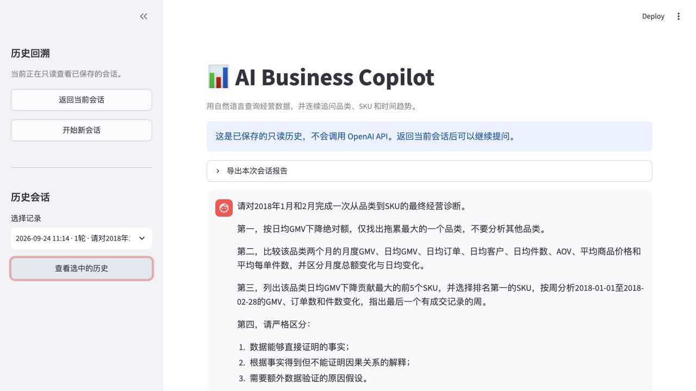
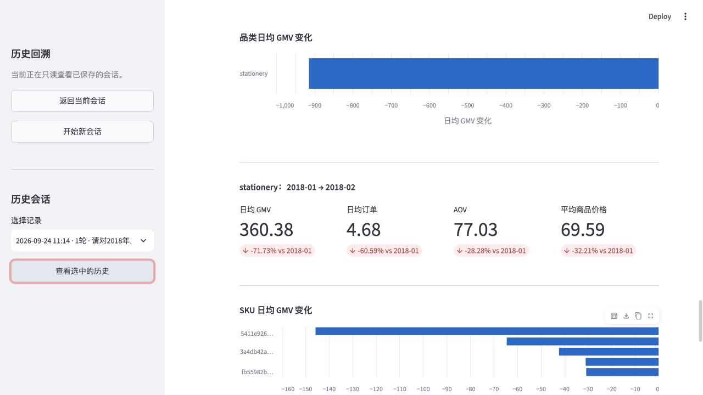
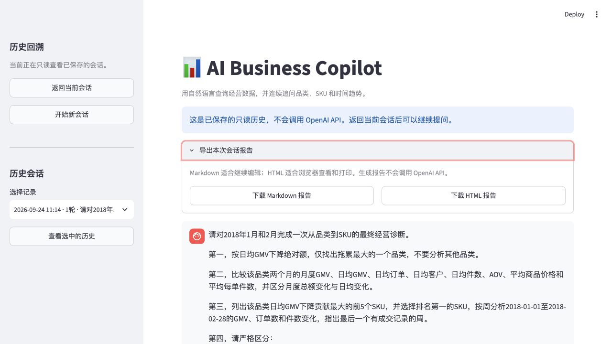
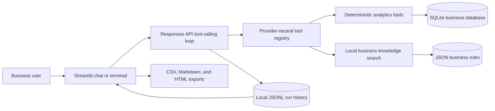

# AI Business Copilot

An evidence-based business analytics agent that turns natural-language questions
into auditable analysis over a local SQLite database.

The project combines deterministic analytics tools, a lightweight business
knowledge base, OpenAI Responses API tool calling, multi-turn conversations,
interactive charts, local run history, and downloadable analysis reports.

> **Status:** local MVP complete. The application and offline acceptance suite
> run locally; public deployment is not included.

## Why this project exists

Business users often know the question they want to answer but not the SQL,
metric definitions, or analytical sequence required to answer it. A general
language model can explain data fluently, but it should not invent figures or
claim unsupported causes.

AI Business Copilot separates those responsibilities:

- deterministic Python tools calculate numeric facts from SQLite;
- a local knowledge base supplies metric definitions and evidence rules;
- the model selects tools, connects results across turns, and communicates the
  analysis;
- every tool call and result remains inspectable and exportable.

## Key capabilities

- **Natural-language analytics:** ask questions in Chinese or English.
- **Autonomous tool selection:** the agent chooses the smallest relevant tool
  and can call several tools across an analysis.
- **Fair month comparison:** reports both monthly totals and calendar-day-
  normalized metrics when month lengths differ.
- **Category-to-SKU drill-down:** finds the largest category contribution and
  continues to the product_id level.
- **Time-trend diagnosis:** analyzes an exact category or SKU by day or
  Monday-based week, including zero-filled and partial periods.
- **Evidence boundaries:** distinguishes observed facts, non-causal
  interpretations, and hypotheses that require more data.
- **Multi-turn memory:** follow-up questions can refer to entities discovered in
  earlier turns.
- **Interactive local UI:** Streamlit chat, KPI cards, contribution bars,
  trend charts, tool details, and CSV downloads.
- **Auditable history:** every turn is stored locally as JSON Lines and grouped
  into read-only historical sessions.
- **Report export:** any visible conversation can be downloaded as editable
  Markdown or a printable standalone HTML report.
- **API-free acceptance checks:** a deterministic evaluation suite protects the
  most important business answers without spending model credits.

## Example workflow

First question:

```text
请找出2018年1月至2月日均GMV下降最大的品类，并找出该品类中
下降贡献最大的SKU。请严格区分数据事实和原因假设。
```

Follow-up question in the same session:

```text
请沿用上一轮结果，按周分析这个SKU的GMV、订单数和件数变化，
并指出最后一个有成交记录的周。
```

The agent can resolve “这个SKU” from the previous turn, query its weekly
trend, and explain that zero delivered-order sales do not by themselves prove
a stockout or delisting.

## Product screenshots

### End-to-end business diagnosis

The local Streamlit interface lets a business user submit a multi-step
diagnostic question and revisit a saved result without making another API call.



### Analytics visualizations

Deterministic tool outputs are converted into category contribution charts,
KPI comparison cards, and SKU-level decline visualizations.



### History and report export

Saved conversations can be reviewed locally and exported as editable Markdown
or a standalone HTML report.



## Architecture



The analytics layer does not depend on an agent framework. `src/tools/registry.py`
exposes JSON-compatible tool definitions and a single execution entry point,
while the model-facing loop lives separately in `src/agent.py`.

## Available tools

| Tool | Purpose |
|---|---|
| `get_monthly_kpis` | Monthly totals, daily-normalized performance, AOV, item price, and freight share |
| `get_category_contribution` | Largest category growth or decline by daily GMV contribution |
| `compare_category` | Total and daily-normalized drivers for one category across two months |
| `get_category_sku_contribution` | Largest product_id-level growth or decline inside one category |
| `get_entity_time_trend` | Zero-filled daily or weekly trend for one category or SKU |
| `search_business_knowledge` | KPI definitions, comparison rules, data limitations, and evidence boundaries |

## Metric definitions

All business metrics use delivered orders from the prepared local database.

| Metric | Definition |
|---|---|
| GMV | Sum of item value, excluding freight |
| Orders | Distinct delivered orders |
| Customers | Distinct `customer_unique_id` values |
| Items | Number of delivered order items |
| AOV | `GMV / orders` |
| Average items per order | `items / orders` |
| Average item price | `GMV / items` |
| Freight share of total paid | `freight / (GMV + freight)` |
| Daily metrics | Monthly value divided by calendar days in that month |

## Evidence and data boundaries

The current dataset does **not** provide product names, formal SKU codes,
inventory snapshots, product listing logs, site traffic, conversion rate,
promotion flags, costs, margin, or marketing-channel performance.

Consequently:

- `product_id` is the only available SKU-level identifier;
- `not_sold_in_compare_month` means no items appeared in delivered-order data
  for that month;
- zero sales do not prove that a product was out of stock, delisted, or
  discontinued;
- a lower average item price does not prove that the business deliberately
  discounted products;
- order or customer decline must not be renamed “traffic decline” without
  traffic data;
- the dataset has no currency metadata, so monetary values must remain
  currency-neutral rather than being labeled as yuan, RMB, USD, BRL, or with
  a currency symbol;
- exact internal source-table names, source-field names, systems, data owners,
  departments, or responsible people must not be claimed unless a tool
  explicitly provides them;
- additional data categories and potentially relevant business functions may
  be suggested, but they must be labeled as suggestions rather than known facts;
- management recommendations must connect to observed evidence and label
  unverified causes as hypotheses;
- the agent must not promise follow-up work that its registered tools cannot
  perform or end with a generic unsupported offer.

These rules live in `knowledge_base/business_rules.json` and are also reinforced
in the agent instructions.

## Project structure

```text
ai-business-copilot/
├── app.py                         # Streamlit chat application
├── docs/
│   └── images/                    # README product screenshots
├── evals/
│   └── cases.json                 # API-free acceptance cases and expected facts
├── knowledge_base/
│   └── business_rules.json        # KPI definitions and evidence rules
├── notebooks/
│   └── 01_data_exploration.ipynb
├── src/
│   ├── agent.py                   # Responses API multi-turn tool loop
│   ├── database.py                # SQLite connection helper
│   ├── offline_evals.py           # Deterministic acceptance runner
│   ├── report_export.py           # Markdown and standalone HTML reports
│   ├── run_history.py             # Local JSONL persistence and history loading
│   ├── ui_helpers.py              # CSV preparation
│   ├── ui_visualizations.py       # Chart and KPI-card preparation
│   └── tools/
│       ├── business_analytics.py  # Monthly, category, and SKU analytics
│       ├── knowledge_base.py      # Local keyword knowledge retrieval
│       ├── registry.py            # Tool schemas and execution registry
│       └── time_trends.py         # Daily and weekly entity trends
├── tests/                         # Unit, integration, UI-helper, and export tests
├── .env.example
├── .gitignore
└── requirements.txt
```

The prepared SQLite database is expected under
`data/processed/business.db`. Data files, API credentials, and local run history
are intentionally excluded from Git.

## Quick start

### 1. Create a Python environment

Python 3.11 is recommended.

```bash
conda create -n ai-copilot python=3.11
conda activate ai-copilot
```

### 2. Install dependencies

From the project root:

```bash
python -m pip install -r requirements.txt
```

### 3. Configure the API

Copy the example file and add a project API key:

```bash
cp .env.example .env
```

```dotenv
OPENAI_API_KEY=your_api_key_here
OPENAI_MODEL=gpt-5-mini
```

The `.env` file is ignored by Git. Never commit or share the real key.

### 4. Provide the local database

Confirm that the prepared database exists at:

```text
data/processed/business.db
```

The database is a local project artifact and is not committed to Git.

### 5. Start the web application

```bash
python -m streamlit run app.py
```

Open `http://localhost:8501` if the browser does not open automatically.
Opening the page, viewing history, rendering charts, downloading CSV files,
and exporting reports do not call the OpenAI API. Submitting a new chat
question does.

## Web application behavior

- **开始新会话** clears the active browser conversation and starts a new
  response chain.
- **历史会话** restores saved questions, answers, tool results, charts, and
  downloads in read-only mode.
- **返回当前会话** returns to the unfinished live browser session.
- **查看本轮使用的数据工具** exposes the exact arguments and result rows used
  for an answer.
- Successful tabular outputs can be downloaded as UTF-8 CSV files.
- **导出本次会话报告** creates Markdown and standalone HTML versions of the
  visible live or historical conversation.

Conversation turns are appended to `runs/agent_runs.jsonl`. Records include a
session ID, turn number, question, tool trace, answer, model, response IDs, and
status. API keys are never stored in run history.

## Terminal interface

The same agent can run without the web UI:

```bash
python -m src.agent
```

Paste a one-line or multi-line question, then type `END` on a new line to
submit. Type `EXIT` when the next question begins to end the session.

## Tests and offline evaluation

Run the full automated test suite:

```bash
python -m unittest discover -s tests -v
```

Run the deterministic business acceptance suite:

```bash
python -m src.offline_evals
```

Current local validation:

- **42 automated tests passed**;
- **7/7 offline business questions passed**;
- **17/17 deterministic fact checks passed**;
- the offline suite makes no OpenAI API request and does not require an API
  key.

The acceptance cases lock down:

1. January and February 2018 KPI values;
2. the category with the largest daily-GMV decline;
3. the selected category's key operating drivers;
4. its largest declining product_id;
5. that SKU's final sales week and zero-sales periods;
6. the knowledge-base boundary that prevents unsupported stockout or delisting
   claims;
7. currency neutrality and the boundary against invented internal table names,
   data owners, or unsupported follow-up promises.

## Security and privacy

- `.env`, SQLite files, raw/processed data, and `runs/` are excluded from Git.
- Report HTML escapes user and model text before rendering.
- Run history stays on the local machine unless the user explicitly shares it.
- The application does not place credentials in prompts, reports, CSV files, or
  history records.

## Current limitations

- The application currently runs locally and has no authentication or hosted
  multi-user environment.
- The prepared SQLite database is excluded from Git; another user must provide
  a compatible local database before running analytics.
- The knowledge retriever is deterministic keyword search, not semantic vector
  retrieval.
- Analysis is limited to the registered tools and fields available in the local
  SQLite dataset.
- The current dataset contains no currency metadata, so displayed amounts are
  intentionally currency-neutral.
- Model answers require an OpenAI API key and create API usage; deterministic
  tools, tests, history, charts, and exports do not.
- Exported reports include conversation text and evidence tables; interactive
  charts are not embedded in the report files.

## Next steps

- Complete one final end-to-end model acceptance run after documentation review.
- Add selected UI screenshots to the repository for portfolio presentation.
- Optionally package the app for controlled deployment with authentication and
  secret management.
